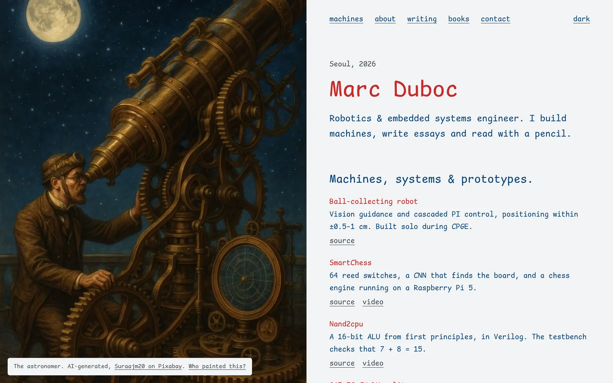
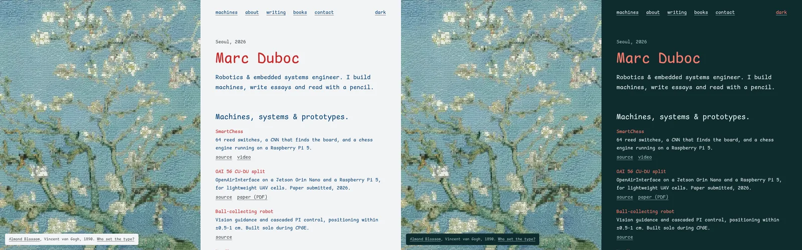
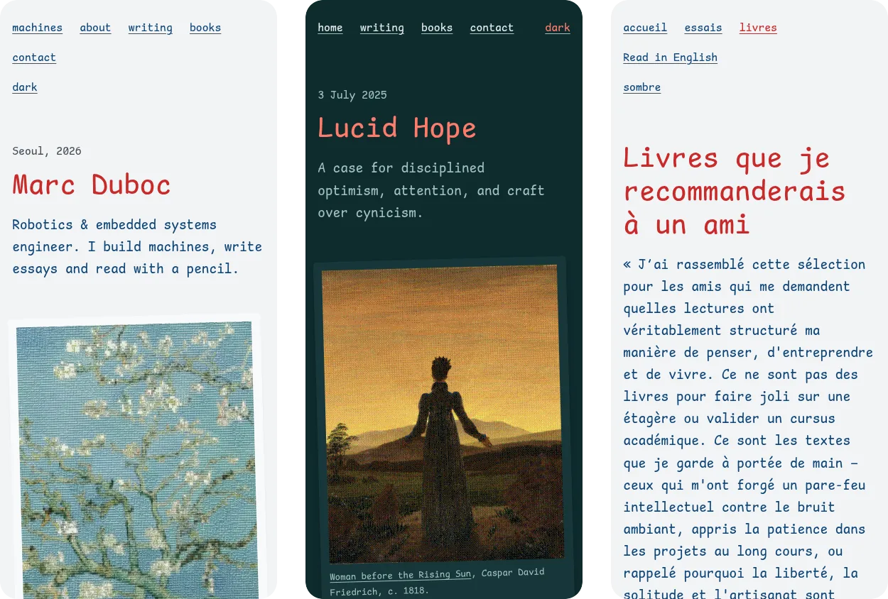
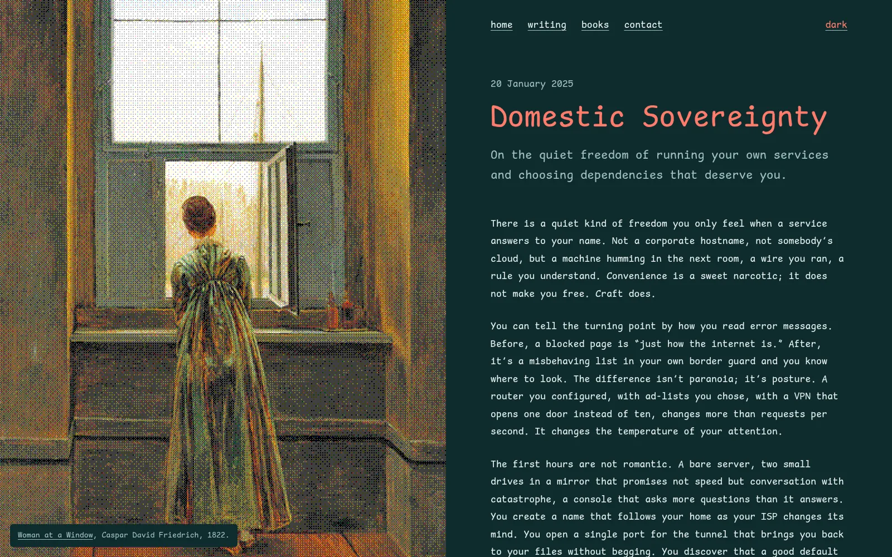
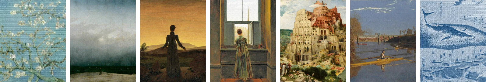
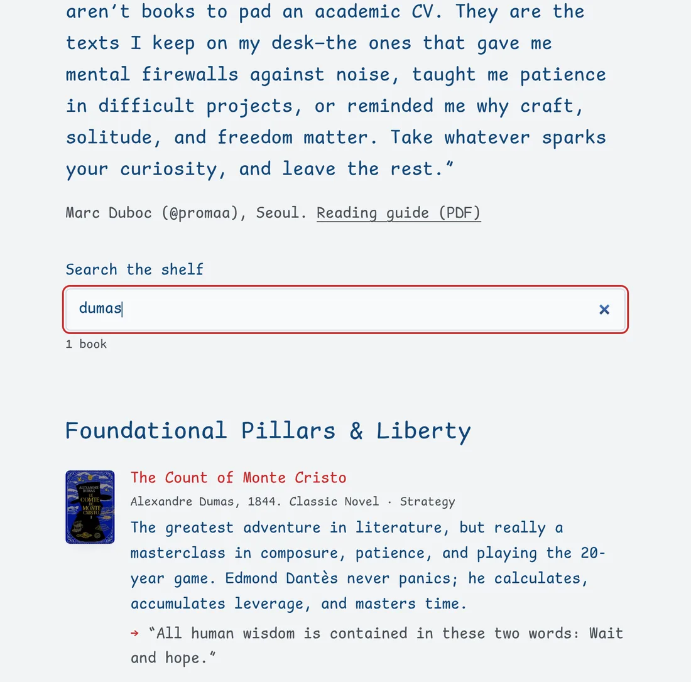
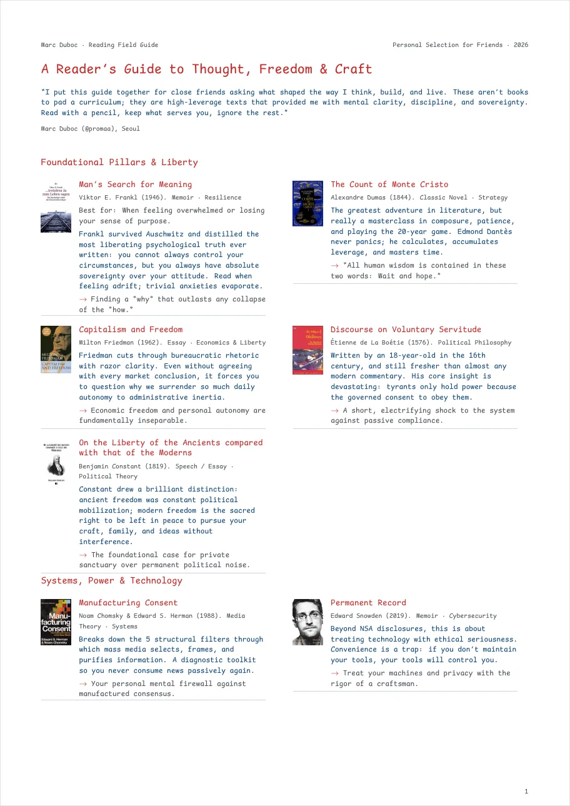

# promaa.tech - the personal site of Marc Duboc

**Machines, essays and books, written in one comic monospace, each page beside its own painting.** The site of a robotics and embedded systems engineer: five builds, five essays, a bilingual shelf of twenty-one books, and the reading guides that go with it. Live at **[promaa.tech](https://promaa.tech)**.

```bash
python3 -m http.server 8000   # then open http://localhost:8000
```

[](https://promaa.tech)
[](https://github.com/promaaa/personal-website/actions/workflows/deploy.yml)
[](https://github.com/promaaa/personal-website/releases)


Plain HTML, CSS and a few kilobytes of vanilla JavaScript, served by GitHub Pages straight from `main`. No framework, no build step, no tracker, no cookie. Every page reads fine with JavaScript off.



## Gallery

| Preview | What it shows |
| --- | --- |
|  | **By day, by night.** Blue ink on paper, or blossom white on the deep teal of the almond tree's sky. The theme follows the system, and the toggle remembers your choice. |
|  | **On a phone** the painting becomes a postcard slipped into the letter. Essays and the shelf keep one readable column. |
|  | **Essays** keep their painting still on the left while the text scrolls, with previous and next links at the end. |
|  | **One painting per page**: Van Gogh's almond tree in letters on the homepage, and on the other pages public-domain paintings by Friedrich, Bruegel, Eakins and Hokusai, redrawn in dots. Each dot painting weighs 40 to 100 KB. |
|  | **The shelf** lists twenty-one books in English and French as static HTML. The search narrows it as you type. |
|  | **Reading guides**: the same shelf typeset as a PDF with XeLaTeX, generated from the same JSON. |

## Features

- **Diptych layout**: on a wide, landscape screen the painting holds the left half while the text scrolls on the right. Phones and upright tablets get a postcard instead, never taller than the screen. On ultra-wide screens the panel stops at 95% of the height and the text is centred in the space left.
- **Paintings in dots**: public-domain paintings redrawn as 400×500 dots with an ordered dither, saved as lossless WebP at 2×, 3× and 4×. Each page sets the painting's focal point, so the panel crops around the subject at any screen ratio. The homepage's painting is drawn in letters instead: 150 × 125 cells of Comic Shanns Mono on a pale wash of the painting's colours, served as AVIF with WebP as the fallback.
- **One family, one weight**: Comic Shanns Mono, standing in for Comic Code. Hierarchy comes from size and colour only: blue ink, and a red for what matters.
- **Light and dark**: both themes are designed, not inverted. Theme switches never animate.
- **Bilingual shelf**: `/books/` and `/books/fr/` are generated from `books/books-en.json` and `books/books-fr.json`, the single source that also feeds the PDF guides.
- **Fast**: about 13 KB of HTML, CSS and JavaScript (gzipped) and one 15 KB font. The homepage painting, in letters, is the heavy part: 144, 270 or 375 KB in AVIF (WebP for older browsers), picked from `srcset` by the panel's real size, so the homepage weighs about 175 KB on a 1× laptop and 300 KB on a 3× phone. The painting is preloaded. Links prerender on hover with Speculation Rules.
- **Accessible**: skip link, visible focus, 44 px targets, landmarks for screen readers, reduced motion respected. Contrast is checked in both themes with axe.
- **Works without JavaScript**: every page and both shelves are plain HTML. Script adds the theme toggle, the search and the copy button on top.
- **Prints cleanly**: a print stylesheet turns any page into a plain letter.

### Measured

Lighthouse, mobile profile:

| Page | Performance | Accessibility | Best practices | SEO | LCP | CLS |
| --- | --- | --- | --- | --- | --- | --- |
| `/` | 100 | 100 | 100 | 100 | 1.7 s | 0 |
| `/essays/` | 100 | 100 | 100 | 100 | 1.4 s | 0 |
| `/essays/lucid-hope/` | 100 | 100 | 100 | 100 | 1.7 s | 0 |
| `/essays/collapse-of-money/` | 100 | 100 | 100 | 100 | 1.8 s | 0 |
| `/books/` | 100 | 100 | 100 | 100 | 1.4 s | 0 |
| `/books/fr/` | 100 | 100 | 100 | 100 | 1.5 s | 0 |

The 404 page is `noindex` on purpose, so it is left out of the SEO column.

## Run it locally

Any static file server works. From the repository root:

```bash
python3 -m http.server 8000
```

The 404 page uses absolute paths, because GitHub Pages serves it at any missing URL. Open it directly at `http://localhost:8000/404.html`.

## Deployment

Every push to `main` deploys through `.github/workflows/deploy.yml`. The workflow uploads the repository as it is; there is nothing to compile.

1. In the repository, open **Settings > Pages** and set **Source** to **GitHub Actions**.
2. Under **Custom domain**, enter `promaa.tech`. The `CNAME` file holds the same name.
3. At the DNS provider, point the apex domain at GitHub Pages:

```text
A     @   185.199.108.153
A     @   185.199.109.153
A     @   185.199.110.153
A     @   185.199.111.153
AAAA  @   2606:50c0:8000::153
AAAA  @   2606:50c0:8001::153
AAAA  @   2606:50c0:8002::153
AAAA  @   2606:50c0:8003::153
```

4. Turn on HTTPS:
   - **Without a proxy**: tick **Enforce HTTPS** in **Settings > Pages** once GitHub has issued the certificate.
   - **Behind Cloudflare** (as promaa.tech is): set **SSL/TLS** to **Full** and turn on **Always Use HTTPS**. GitHub cannot issue its own certificate behind the proxy.

## Add an essay

1. Copy an existing essay folder, for example `essays/lucid-hope/`, to `essays/<slug>/`.
2. In its `index.html`, change the title, the description, the canonical URL, the dates (`<time>`, `article:published_time` and the JSON-LD), and the paragraphs inside `<article class="prose">`.
3. Make its painting and its social card (see [Change a painting](#change-a-painting)):

```bash
./paint.sh dots crop.png essays/<slug>/painting
./paint.sh card essays/<slug>/painting "Essay title" "The one-line description." "An essay by Marc Duboc · promaa.tech" essays/<slug>/og.jpg
```

4. In the `<figure class="painting">`, write a real `alt`, the credit in the `<figcaption>`, and the focal point in `style="--panel-focus: x% y%"`.
5. Link it from `essays/index.html`, from the list on the homepage, and from the previous and next essays. Then add it to `sitemap.xml`.

## Add a book

The JSON files are the single source for the shelf and the PDFs. Edit them, never the generated HTML or `.tex`.

1. Add the entry to the right section in **both** `books/books-en.json` and `books/books-fr.json`:

```json
{
  "num": "22",
  "title": "The Little Prince",
  "author": "Antoine de Saint-Exupéry",
  "year": "1943",
  "tag": "Novella · Philosophy",
  "note": "Why the book matters, in two or three sentences.",
  "spark": "The line you would quote to a friend.",
  "cover": "22-saint-exupery"
}
```

An optional `"best_for"` adds a "Best for" line on the shelf and in the PDF.

2. Add the cover in two sizes, from any large image:

```bash
magick cover.jpg -resize 160x -strip -quality 70 assets/images/books/22-saint-exupery.webp
magick cover.jpg -resize 240x -strip -quality 82 -interlace JPEG assets/images/books/22-saint-exupery.jpg
```

3. Regenerate the shelf and the PDFs:

```bash
./generate-pdfs.sh
```

This needs Python 3, ImageMagick (to read the cover sizes) and [tectonic](https://tectonic-typesetting.github.io/), either on `PATH` or in `.tools/tectonic`. It rewrites `books/index.html`, `books/fr/index.html`, both `.tex` files, and both PDFs in `assets/docs/`.

## Change a painting

Every page with a painting has the same three pieces: the `<figure class="painting">`, the image preload in the `<head>`, and a social card (`og.jpg`). `paint.sh` makes the images; it needs ImageMagick 7.

1. Pick a picture you may publish, ideally a public-domain painting at least 1600 px tall, with its subject near the middle.
2. Crop it to 4:5, the ratio of the panel. For example, to keep a 2064 px wide slice starting 810 px from the left:

```bash
magick source.jpg -crop 2064x2580+810+0 +repage crop.png
```

3. Make the three sizes, in coloured dots or in the site's blue ink:

```bash
./paint.sh dots crop.png assets/images/ninth-wave   # ninth-wave-800.webp, -1200, -1600
./paint.sh ink crop.png assets/images/goto-whaling   # for a print: ink on paper, inverted in the dark theme
```

4. Make the social card, 1200×630, the painting beside the page title:

```bash
./paint.sh card assets/images/ninth-wave "Marc Duboc" "Robotics & embedded systems engineer." "promaa.tech · Seoul" assets/images/og.jpg
```

5. In the page, point the `src`, `srcset` and preload `imagesrcset` at the new files, and write the `alt` and the credit. Set `--panel-focus` on the figure to the point the panel must keep in view when it crops, for example `style="--panel-focus: 40% 80%"` for the sailors at the bottom of *The Ninth Wave*. A print drawn in ink takes the class `painting ink`.

## Design tokens

`assets/css/tokens.css` is the single source of every design value: colour, type scale, space, radius, shadow, easing, duration, plus a block for print. Components in `assets/css/site.css` only read them through `var()`.

- **Type and space**: fluid `clamp()` scales from [Utopia](https://utopia.fyi), 16 to 18 px between 320 and 1440 px viewports.
- **Colour**: [Open Props](https://open-props.style) values, and a teal sampled from the homepage painting. Light is blue ink on paper with a red accent. Dark reads the same letter at night under the almond tree: blossom-white text on the deep teal of its sky, with a coral red for what matters.
- **Motion**: three tokens, curves from [Kinetics](https://kinetics.colorion.co) sampled into `linear()`. Reduced motion shortens or removes all of them.
- **Breakpoint**: one, at `56rem` on a screen at least 5:4 wide, where the painting becomes a fixed panel `--panel-width` wide. Media queries cannot read custom properties, so the query is written in `site.css` and in each image's `sizes`, and documented in `tokens.css`.

## Using Comic Code

The site is designed for [Comic Code](https://tosche.net/fonts/comic-code), a commercial typeface. Until a web licence is in place it ships Comic Shanns Mono, which keeps the same spirit. The font stack already names Comic Code first, so anyone who has it installed sees it. To serve it to everyone:

1. Put the licensed `.woff2` in `assets/fonts/`.
2. In `assets/css/tokens.css`, point the `@font-face` at it and rename the family to `"Comic Code"`.
3. Update the font preload in each page's `<head>`, and in `books/generate.py`.

## Versioning

Releases follow [Semantic Versioning](https://semver.org/) and are tagged on `main`: `v1.0.0` is the previous site, `v2.x` is this one.
- **Major**: a redesign or a changed URL.
- **Minor**: new content.
- **Patch**: fixes.

Changes land through pull requests and are recorded in [CHANGELOG.md](CHANGELOG.md).

When a release changes a CSS or JavaScript file, raise the `?v=` on every link to it, in each page and in `books/generate.py`. Cloudflare lets browsers keep those files for four hours, so without a new `?v=` a returning visitor gets the new page with the old styles. The eggs follow `site.js`'s own `?v=` by themselves.

## Credits

- **Font**: [Comic Shanns Mono](https://github.com/jesusmgg/comic-shanns-mono) by Shannon Miwa and Jesus Gonzalez, under the MIT licence ([LICENSE](assets/fonts/LICENSE-comic-shanns-mono.md)). A middle dot glyph was added for this site.
- **Homepage**: [*Almond Blossom*](https://commons.wikimedia.org/wiki/File:Vincent_van_Gogh_-_Almond_blossom_-_Google_Art_Project.jpg), Vincent van Gogh, 1890, in the public domain, redrawn in letters for this site.
- **Paintings** on the other pages, all in the public domain, redrawn in dots for this site:
  - [*The Monk by the Sea*](https://commons.wikimedia.org/wiki/File:Caspar_David_Friedrich_-_Der_M%C3%B6nch_am_Meer_-_Google_Art_Project.jpg), Caspar David Friedrich, 1808–1810;
  - [*Woman before the Rising Sun*](https://commons.wikimedia.org/wiki/File:Caspar_David_Friedrich_-_Frau_vor_untergehender_Sonne.jpg), Caspar David Friedrich, c. 1818;
  - [*Woman at a Window*](https://commons.wikimedia.org/wiki/File:Caspar_David_Friedrich_-_Frau_am_Fenster_-_Google_Art_Project.jpg), Caspar David Friedrich, 1822;
  - [*The Tower of Babel*](https://commons.wikimedia.org/wiki/File:Pieter_Bruegel_the_Elder_-_The_Tower_of_Babel_(Vienna)_-_Google_Art_Project_-_edited.jpg), Pieter Bruegel the Elder, 1563;
  - [*Max Schmitt in a Single Scull*](https://commons.wikimedia.org/wiki/File:The_Champion_Single_Sculls_(Max_Schmitt_in_a_Single_Scull)_MET_DT86.jpg), Thomas Eakins, 1871;
  - [*Whaling off the Gotō Islands*](https://commons.wikimedia.org/wiki/File:Whaling_off_the_Coast_of_the_Goto_Islands.jpg), Katsushika Hokusai, c. 1833.
- **Design references**: [Utopia](https://utopia.fyi), [Open Props](https://open-props.style), [Kinetics](https://kinetics.colorion.co), and the checklists of [Rauno Freiberg](https://interfaces.rauno.me) and [ui-skills](https://www.ui-skills.com).

## Contact

Write to [marc.duboc@imt-atlantique.net](mailto:marc.duboc@imt-atlantique.net), or find me on [GitHub](https://github.com/promaaa), [LinkedIn](https://www.linkedin.com/in/marc-duboc1/) and [X](https://x.com/proma__).
