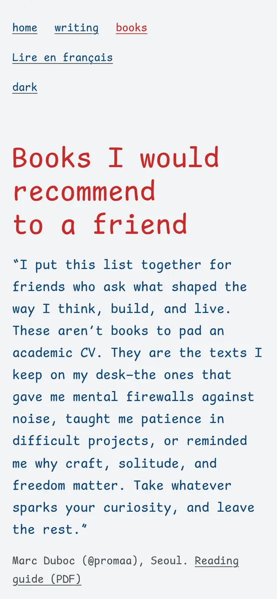

# promaa.tech - Marc Duboc's site

**Machines, essays and books, written in one comic monospace beside one painting.** The personal site of a robotics and embedded systems engineer: five builds, five essays, a bilingual shelf of twenty-one books and the reading guides that go with it.

```bash
python3 -m http.server 8000   # then open http://localhost:8000
```

[](https://github.com/promaaa/personal-website/actions/workflows/deploy.yml)


Plain HTML, CSS and a few kilobytes of vanilla JavaScript, served by GitHub Pages straight from `main`. No framework, no build step, no tracker, no cookie. Light and dark follow the system, and every page reads fine with JavaScript off.


## Gallery

| Preview | Page |
| --- | --- |
|  | An essay at night: the illustration holds still while the text scrolls |
|  | The shelf on a phone: twenty-one books, searchable, in English and in French |

## What is in it

- **Home** (`/`): the machines, the background, the essays, and how to get in touch.
- **Essays** (`/essays/`): five long-form pieces, each with its own illustration.
- **Shelf** (`/books/`, `/books/fr/`): the books I recommend to friends, generated as static HTML from `books/books-en.json` and `books/books-fr.json`.
- **Reading guides** (`/assets/docs/`): the same shelf as a printable PDF in English and French, typeset with XeLaTeX from the same JSON.
- **Diptych layout**: on a wide screen the painting holds the left half while the text scrolls on the right; on a phone it becomes a postcard slipped into the letter.
- **One family, one weight**: Comic Shanns Mono stands in for Comic Code. Hierarchy comes from size and the airmail colours only: blue ink, a red for what matters.
- **Fast**: about 12 KB of HTML, CSS and JS on the homepage (gzipped) and one 15 KB font. Images are AVIF with a WebP fallback, sized to their slot. Links prerender on hover through Speculation Rules.
- **Accessible**: keyboard first (skip link, visible focus, 44 px targets), screen-reader landmarks, reduced motion respected, contrast checked in both themes with axe.

### Measured

Lighthouse, mobile profile, on every page:

| Page | Performance | Accessibility | Best practices | SEO | LCP | CLS |
| --- | --- | --- | --- | --- | --- | --- |
| `/` | 100 | 100 | 100 | 100 | 1.8 s | 0 |
| `/essays/` | 100 | 100 | 100 | 100 | 1.7 s | 0 |
| `/essays/lucid-hope/` | 100 | 100 | 100 | 100 | 1.4 s | 0 |
| `/books/` | 100 | 100 | 100 | 100 | 1.4 s | 0 |
| `/books/fr/` | 100 | 100 | 100 | 100 | 1.4 s | 0 |

The 404 page is `noindex` on purpose, so its SEO score stays out of the table.

## Run it locally

Any static file server works. From the repository root:

```bash
python3 -m http.server 8000
```

The 404 page uses absolute paths (GitHub Pages serves it at any missing URL), so open it at `http://localhost:8000/404.html` rather than through a broken link.

## Deployment

Every push to `main` deploys through `.github/workflows/deploy.yml`. The workflow uploads the repository as it is: there is nothing to compile.

1. In the repository, open **Settings > Pages** and set **Source** to **GitHub Actions**.
2. Under **Custom domain**, enter `promaa.tech` (the `CNAME` file holds the same name).
3. At the DNS provider, point the apex domain at GitHub Pages:

```text
A     @   185.199.108.153
A     @   185.199.109.153
A     @   185.199.110.153
A     @   185.199.111.153
AAAA  @   2606:50c0:8000::153
AAAA  @   2606:50c0:8001::153
AAAA  @   2606:50c0:8002::153
AAAA  @   2606:50c0:8003::153
```

4. Once the certificate is issued, tick **Enforce HTTPS**.

## Add an essay

1. Copy an existing essay folder, for example `essays/lucid-hope/`, to `essays/<slug>/`.
2. In its `index.html`, change the title, description, canonical URL, dates (`<time>`, `article:published_time` and the JSON-LD) and the paragraphs inside `<article class="prose">`.
3. Replace the illustration. From a source image `picture.png`:

```bash
cd essays/<slug>
for w in 600 1024; do
  magick picture.png -resize ${w}x -strip -quality 55 picture-$w.avif
  magick picture.png -resize ${w}x -strip -quality 72 picture-$w.webp
done
rm picture.png
```

4. Update the `width` and `height` of the `` to the 1024px version (`identify picture-1024.webp`) and write a real `alt`.
5. Link it from `essays/index.html`, from the list on the homepage, and from the previous and next essays, then add it to `sitemap.xml`.

## Add a book

The JSON files are the single source for the shelf and the PDFs. Edit them, never the generated HTML or `.tex`.

1. Add the entry to the right section in **both** `books/books-en.json` and `books/books-fr.json`:

```json
{
  "num": "22",
  "title": "The Little Prince",
  "author": "Antoine de Saint-Exupéry",
  "year": "1943",
  "tag": "Novella · Philosophy",
  "note": "Why the book matters, in two or three sentences.",
  "spark": "The line you would quote to a friend.",
  "cover": "22-saint-exupery"
}
```

An optional `"best_for"` adds a "Best for" line on the shelf and in the PDF.

2. Add the cover in two sizes, from any large image:

```bash
magick cover.jpg -resize 160x -strip -quality 70 assets/images/books/22-saint-exupery.webp
magick cover.jpg -resize 240x -strip -quality 82 -interlace JPEG assets/images/books/22-saint-exupery.jpg
```

3. Regenerate the shelf and the PDFs:

```bash
./generate-pdfs.sh
```

This needs Python 3, ImageMagick (to read the cover sizes) and [tectonic](https://tectonic-typesetting.github.io/), either on `PATH` or in `.tools/tectonic`. It rewrites `books/index.html`, `books/fr/index.html`, both `.tex` files and both PDFs in `assets/docs/`.

## Change the painting

The homepage painting lives in three places: the `<picture>` in `index.html`, its preload in the `<head>`, and `assets/images/og.jpg` (the social preview). Produce the variants the same way as an essay illustration (`astronomer-400` and `astronomer-853`, AVIF and WebP), then update the `alt`, the credit in the `<figcaption>` and `--panel-focus` in `assets/css/tokens.css` if the subject sits off-centre.

## Design tokens

`assets/css/tokens.css` is the single source of every design value: colour, type scale, space, radius, shadow, easing, duration, plus a block for print. Components in `assets/css/site.css` only read them through `var()`.

- **Type and space**: fluid `clamp()` scales from [Utopia](https://utopia.fyi), 16 to 18 px between 320 and 1440 px viewports.
- **Colour**: [Open Props](https://open-props.style) values. Light is blue ink on paper with a red accent; dark keeps the same letter at night.
- **Motion**: three tokens, curves from [Kinetics](https://kinetics.colorion.co) sampled into `linear()`. Reduced motion shortens or removes all of them.
- **Breakpoint**: one, at `56rem`, where the painting becomes a fixed panel. Media queries cannot read custom properties, so it is written in `site.css` and documented in `tokens.css`.

## Using Comic Code

The site is designed for [Comic Code](https://tosche.net/fonts/comic-code), a commercial typeface. Until a web licence is in place it ships Comic Shanns Mono, which keeps the same spirit. The font stack already names Comic Code first, so it is used by anyone who has it installed. To serve it to everyone:

1. Put the licensed `.woff2` in `assets/fonts/`.
2. In `assets/css/tokens.css`, point the `@font-face` at it and rename the family to `"Comic Code"`.
3. Update the font preload in the pages' `<head>` (and in `books/generate.py`).

## Versioning

Releases follow [Semantic Versioning](https://semver.org/) and are tagged on `main` (`v1.0.0` is the previous site, `v2.0.0` this one). Changes land through pull requests and are recorded in [CHANGELOG.md](CHANGELOG.md): major for a redesign or a changed URL, minor for new content, patch for fixes.

## Credits

- **Font**: [Comic Shanns Mono](https://github.com/jesusmgg/comic-shanns-mono) by Shannon Miwa and Jesus Gonzalez, MIT licence ([LICENSE](assets/fonts/LICENSE-comic-shanns-mono.md)). A middle dot glyph was added for this site.
- **Homepage painting**: *The astronomer*, AI-generated, by [Suraajm20 on Pixabay](https://pixabay.com/illustrations/ai-generated-steampunk-astronomer-9610010/), under the [Pixabay Content License](https://pixabay.com/service/license-summary/).
- **Design references**: [Utopia](https://utopia.fyi), [Open Props](https://open-props.style), [Kinetics](https://kinetics.colorion.co), and the checklists of [Rauno Freiberg](https://interfaces.rauno.me) and [ui-skills](https://www.ui-skills.com).

## Contact

Write to [marc.duboc@imt-atlantique.net](mailto:marc.duboc@imt-atlantique.net), or find me on [GitHub](https://github.com/promaaa), [LinkedIn](https://www.linkedin.com/in/marc-duboc1/) and [X](https://x.com/proma__).
